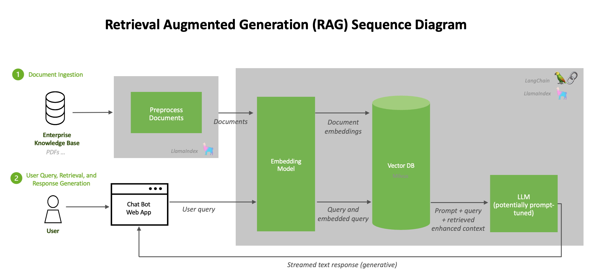

# 🧠 基于 RAG 的高级推理模型实战教程

本项目演示如何结合 **NVIDIA 的高级推理大模型**（如 [Nemotron](https://build.nvidia.com/nvidia/llama-3_1-nemotron-nano-8b-v1)）与 **RAG（Retrieval-Augmented Generation）技术**，构建一个具备推理能力的智能问答系统。

------

## 📌 项目概览

本教程的目标是实现一个智能聊天机器人，具备以下能力：

- 接入 NVIDIA 推理大模型，处理复杂问题
- 支持动态控制是否开启推理模式（reasoning on/off）
- 借助 RAG 技术从外部知识中检索答案，提升准确性
- 封装为可复用的类结构，便于拓展

> 💡 本项目适用于希望学习“推理+检索”结合应用的开发者或研究人员



------

## 🧪 将学到的内容

1. **接入 NVIDIA NIM 模型服务**
    通过 API 方式访问 Nemotron 模型，进行推理问答。
2. **推理模型的使用与对比**
    探索开启/关闭推理后的回答差异，理解模型的逻辑能力。
3. **基于 LangChain 的 RAG 构建**
    使用 PyMuPDF 读取 PDF，利用 LangChain 构建知识检索链，结合 FAISS 实现向量化检索。
4. **类结构封装设计**
    封装为 `ARReasoningRAG` 类，方便二次开发和功能组合。

------

## ⚙️ 安装依赖

运行以下命令安装环境：

```bash
pip install langchain faiss-cpu openai pymupdf
```

同时需要：

- Python 3.8 以上版本
- [NVIDIA NGC Catalog](https://catalog.ngc.nvidia.com/) 注册获取的 API Key

------

## 🚀 使用说明

1. **申请 NVIDIA API Key**
   - 点击 [注册页面](https://catalog.ngc.nvidia.com/orgs/nvidia/teams/ai-foundation/models)
   - 获取免费试用的 5000 API 点数（前 1000 点自动发放，后 4000 可申请）
2. **运行 Notebook**
   - 上传你的 PDF 文件作为知识库
   - 创建推理 + RAG 结合的类实例
   - 输入问题，选择是否使用推理功能
3. **代码示例**

```python
rag_chat = ARReasoningRAG(...)
rag_chat.query("为什么大模型需要推理能力？", use_reasoning=True)
```

------

## 📁 示例

> **Before RAG and Reasoning**
> executor("What is ChipNeMo?")
>
> Hint: 从下面的回答发现模型完全不知道什么是ChipNeMo

ChipNeMo is a recent advancement in the field of natural language processing (NLP) and speech processing. Here's a breakdown of what ChipNeMo is:

**Name Explanation**:
- **Chip**: Refers to the integrated circuit or hardware aspect, indicating that the model is optimized for or related to specific hardware (chips) for efficient processing.
- **NeMo**: Stands for "Neural Modules," which are pre-trained, modular components designed for various NLP tasks. NeMo itself is a toolkit developed by NVIDIA for building, training, and deploying state-of-the-art neural language models and speech models.

**What is ChipNeMo?**

ChipNeMo specifically refers to a set of pre-trained speech models and a toolkit designed by NVIDIA, optimized for efficient deployment on NVIDIA hardware (GPUs and potentially other chips). The primary focus of ChipNeMo is on speech processing tasks, including but not limited to:

1. **Automatic Speech Recognition (ASR)**: Transcribing spoken language into text.
2. **Text-to-Speech (TTS)**: Synthesizing natural-sounding speech from text.
3. **Voice Activity Detection (VAD)**: Identifying periods of speech in an audio signal.
4. **Speaker Recognition**: Identifying the speaker in an audio clip.

**Key Features and Benefits of ChipNeMo**:

- **Efficiency**: Optimized for NVIDIA hardware, ensuring high performance and low latency, which is crucial for real-time applications. This optimization enables faster processing and more efficient resource utilization.
- **Accuracy**: Leveraging advanced neural network architectures and large-scale pre-training, ChipNeMo achieves state-of-the-art or competitive results in various speech tasks.
- **Ease of Use**: The toolkit provides pre-trained models, simplified APIs, and integration with popular deep learning frameworks, facilitating rapid development and deployment of speech-enabled applications.
- **Customizability**: Users can fine-tune pre-trained models on their specific datasets to adapt to particular domains, accents, or languages, enhancing the model's versatility for diverse use cases.

**Practical Applications**:

- **Virtual Assistants**: ChipNeMo can improve the responsiveness and accuracy of virtual assistants, such as smart speakers or voice-controlled interfaces.
- **Voice-Enabled Services**: It enhances voice search, voice commands in vehicles, and other voice-driven applications by providing more reliable and efficient speech recognition.
- **Healthcare and Accessibility**: ChipNeMo can be used to develop assistive technologies, such as voice-controlled systems for individuals with disabilities, or medical transcription tools that quickly and accurately convert voice recordings to text.

**Target Audience**:

- **Researchers**: In the fields of NLP, speech processing, and AI, who wish to explore, extend, or apply state-of-the-art speech technologies.
- **Developers**: Building applications that require speech recognition, synthesis, or related functionalities (e.g., voice assistants, voice-enabled services).
- **Enterprises**: Seeking to integrate advanced speech capabilities into their products or services, enhancing user experience and engagement.

For the most current information, including specific model architectures, performance benchmarks, and detailed documentation, I recommend visiting the official NVIDIA website or the NeMo toolkit repository.

> **After RAG and Reasoning**
>
> executor.set_reasoning_mode("on")
>
> executor("What is ChipNeMo?")

```markdown
<think>
Okay, so I need to figure out what ChipNeMo is. Let me start by breaking down the name. "Chip" probably refers to a semiconductor chip, like the ones used in computers or other electronic devices. "NeMo" might be an acronym. In tech, acronyms are common, so maybe NeMo stands for something like Neural Memory or Neuro-Morphic something. 

Wait, I remember that there's a company called NVIDIA that makes chips, especially GPUs. They have something called NVIDIA NeMo, which is a framework for building and training neural networks, particularly for natural language processing and speech. So maybe ChipNeMo is related to that? But the user is asking about ChipNeMo specifically, not just NeMo.

Alternatively, could it be a specific chip designed for neural networks or AI tasks? Maybe a chip that's optimized for running models developed with NeMo? Let me check if there's any recent news about NVIDIA releasing a new chip with that name. I know they have the H100 and other data center GPUs, but ChipNeMo doesn't ring a bell immediately.

Wait, maybe it's a research project or a code name. Sometimes companies use code names for products before release. If I search my memory for recent AI chip announcements, I don't recall ChipNeMo being a major one. Alternatively, could it be a misunderstanding or a misspelling? Like, maybe they meant "Chiplet" or "NeMo" as part of a different product name.

Another angle: In the context of AI infrastructure, there's a trend towards specialized chips for accelerating AI workloads. If NeMo is a software framework, perhaps ChipNeMo is a hardware accelerator designed to work efficiently with that framework. That would make sense—software and hardware co-design is a big deal these days for optimizing performance.

But without more information, it's hard to be certain. I should also consider that the user might have heard the term in a specific context, like a research paper or a tech conference, which I might not be aware of. Alternatively, it could be a lesser-known project or a proprietary technology from a startup.

Wait, let me think again. NVIDIA NeMo is indeed their toolkit for conversational AI. So if there's a ChipNeMo, maybe it's a custom ASIC or a specialized GPU designed specifically to run NeMo models more efficiently. That would be a logical step—creating hardware optimized for their own software stack. But I haven't heard of such a chip being officially announced by NVIDIA. Their latest chips are the Grace Hopper Superchips, H100, and the upcoming B200, but not ChipNeMo.

Alternatively, maybe it's a third-party product. A company other than NVIDIA might have developed a chip that's compatible with or optimized for the NeMo framework. For example, some startups design AI accelerator chips that target specific frameworks or model types. If that's the case, ChipNeMo could be one of those niche products.

Another possibility is that ChipNeMo is part of an academic research project. Universities or research institutions sometimes develop prototype chips to test new architectures. If NeMo is a framework they're using, the chip could be an experimental hardware component designed to work with it.

Wait, but the user is asking for a straightforward answer. If I don't have enough information, I should state that. However, based on the name, the most plausible explanation is that ChipNeMo refers to a hardware accelerator or a specialized chip designed to work efficiently with the NVIDIA NeMo software framework, which is used for developing conversational AI models. This would be in line with the trend of creating customized silicon for AI workloads to improve performance and energy efficiency.

Alternatively, it's possible that the term is a mix-up or a specific internal project name that hasn't been widely publicized. Without more context or an official announcement, it's challenging to provide a definitive answer. The safest approach is to explain the possible connections based on the name components and existing technologies, while clarifying the uncertainty.
</think>

ChipNeMo is not a widely recognized or officially announced product in the public domain as of my last update. However, based on the name components, here's a plausible explanation:

1. **NVIDIA NeMo Connection**: NVIDIA NeMo is a popular open-source framework for building and training conversational AI models (e.g., speech recognition, language models). If "ChipNeMo" exists, it might refer to a **hypothetical or niche hardware accelerator** designed to optimize the performance of NeMo-based models. This would align with the industry trend of creating specialized AI chips (like GPUs/TPUs) tailored for specific software frameworks.

2. **Possible Speculation**: 
   - It could be a **research project**, **startup product**, or **internal codename** for a chip designed to efficiently run NeMo workloads.
   - Alternatively, it might be a **mishearing or misspelling** of a similar term (e.g., "chiplet" designs for AI systems).

3. **Current Status**: As of now, there is no official announcement from NVIDIA or major chip manufacturers about a product named "ChipNeMo." If you encountered this term in a specific context (e.g., a paper, presentation, or rumor), it may require further investigation within that niche.

**Conclusion**: Without additional context, "ChipNeMo" likely refers to a specialized hardware accelerator for NVIDIA NeMo or a related AI framework, but it is not a widely acknowledged product. For definitive information, consult the source where the term was encountered or wait for official announcements.
```

> executor.set_reasoning_mode("on")
>
> executor("If I have only 8 A100 GPUs, how long does it take to train a 7B ChipNeMo model?")

```markdown
<think>
Okay, let's tackle the user's question. They want to know how long it takes to train a 7B ChipNeMo model using only 8 A100 GPUs. 

First, I need to recall the information provided in the context. The context mentions that all models were trained using 128 A100 GPUs. For the 7B model, the training cost for DAPT is 2,620 GPU hours, and SFT is 90 GPU hours. 

So, the total training time for DAPT and SFT combined would be 2,620 + 90 = 2,710 GPU hours when using 128 GPUs. Now, the user has only 8 GPUs. Since the number of GPUs affects the total training time inversely, we can calculate the time by dividing the total GPU hours by the number of GPUs they have.

Let me check the math again. For 128 GPUs, it's 2,710 GPU hours. If we use 8 GPUs instead, the time required would be 2,710 / 8 = 338.75 hours. Converting that to days, 338.75 / 24 ≈ 14.1 days. 

Wait, but the context also mentions that the total number of training steps for DAPT is 23,200 steps. However, the user might not need that detail since the GPU hours are already provided. The key is scaling from 128 GPUs to 8 GPUs. 

I should also consider if there's any mention of scaling efficiency. The context doesn't provide details on how well the training scales with fewer GPUs, so we assume linear scaling, which might not be perfect, but it's the best we can do with the given info. 

So the answer would be approximately 339 hours or about 14 days on 8 A100 GPUs. But I should present it in hours unless the user specifies the format. The answer should be in a box as per instructions.
</think>

The training time for a 7B ChipNeMo model using 8 A100 GPUs can be estimated based on the provided context. 

- **Total GPU hours for 7B model training (DAPT + SFT):**  
  2,620 (DAPT) + 90 (SFT) = **2,710 GPU hours** (using 128 GPUs).  

- **Scaling to 8 GPUs:**  
  Total time = Total GPU hours / Number of GPUs = 2,710 / 8 ≈ **338.75 hours** (~14 days).  

**Answer:**  
\boxed{339 \text{ hours}}
```


## 📁 项目结构

- `Advanced_Reasoning_with_RAG.ipynb` — 主教程文件，包含全部代码
- `README.md` — 项目说明文档
- PDF 文件 — 自定义知识库文档（运行时上传）

------

## 📚 致谢来源

本项目参考和基于以下技术与平台实现：

- NVIDIA NIM API & Nemotron 推理模型
- LangChain RAG 框架
- FAISS 向量检索库
- Machine Learning Spring2025 Course from NTU
